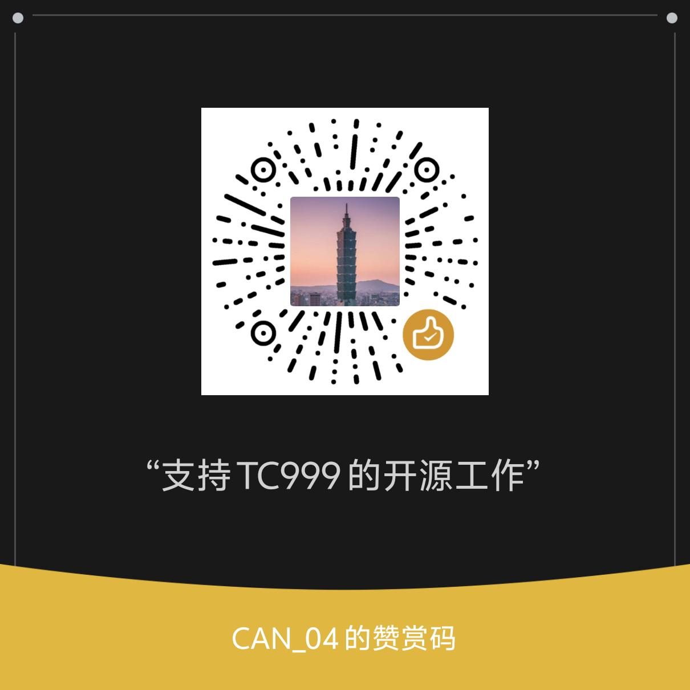

# [AppDataCleaner - 适用于 Windows 系统的 appdata 文件夹清理工具][repo-url]

 [![GitHub issues][issues-image]][issues-url]
 [![Github Pulls][pulls-image]][pulls-url]
 [![GitHub stars][stars-image]][stars-url]
 [![GitHub forks][forks-image]][forks-url]
 [![Github Downloads][download-image]][download-url]
 [![license][license-image]][license-url]
 ![repo-size][repo-size-image]
 <!--[![hits][hits-image]][hits-url1]-->

 > [!important]
>
> 由于现有源码架构混乱且难以维护，即将开始重写，新版源码将采用前后端分离模式

完全开源免费的清理 Appdata 的小工具！完全使用 ChatGPT 生成！

<details>
<summary><h2>开发原因</h2></summary>
<p>Windows系统安装的软件卸载时，即便使用专业卸载工具卸载后，appdata 中的文件仍旧不会删除，故开发此软件清理。</p>
<p>本工具使用 Rust 编写，使用 ChatGPT 生成，并使用 egui 构建 GUI。</p>
<p>本工具完全开源免费，欢迎各位大佬贡献代码。</p>
</details>

> [!warning]
>
> 本项目从未发布至 GitCode，如您发现请截图并保留证据

## 🖥系统要求
- Windows 8 及以上
- Windows 7 测试中

## 使用方法

### 📦下载exe文件
- [发行版](https://github.com/TC999/AppDataCleaner/releases/latest)
- [CI 构建](https://github.com/TC999/AppDataCleaner/actions/workflows/ci.yml)
- [Windows Cleaner（内置，版本手动更新）](https://github.com/darkmatter2048/WindowsCleaner)

以上两种方法二选一，下载后直接解压运行即可。

## 星标历史

<a href="https://star-history.com/#TC999/AppDataCleaner&Date">
 <picture>
   <source media="(prefers-color-scheme: dark)" srcset="https://api.star-history.com/svg?repos=TC999/AppDataCleaner&type=Date&theme=dark" />
   <source media="(prefers-color-scheme: light)" srcset="https://api.star-history.com/svg?repos=TC999/AppDataCleaner&type=Date" />
   
 </picture>
</a>

### 运行
> [!caution]
>
> 请注意，删除操作不可逆，请谨慎操作。
- 双击运行
- 点击“立即扫描”,软件会自动扫描 Appdata 文件夹，并显示扫描结果。
- 自行选择“删除”或“移动”（暂未实现）
#### 关于文件夹描述
程序默认不带任何规则，请自行下载规则并放到软件根目录，后续出模板

这是[作者本人维护的描述规则](https://github.com/TC999/TC999-subscription)

### 从源码编译
#### 本地编译
- 安装 Rust
- 克隆此仓库
```
git clone https://github.com/TC999/AppDataCleaner.git
```
- 进入项目目录
```
cd AppDataCleaner
```
- 运行
```
cargo run
```
- 编译
```
cargo build --release
```
- 编译产物在 target/release 目录下
#### 或直接运行 CI 构建

## 代码结构说明
- `src`: 程序源代码目录
- `assets`: 资源文件目录(注：字体文件不可删除，否则运行会显示方块！)
- `Cargo.toml`: 依赖管理文件

## ✔ 待办
- [x] 白名单模块（防止误删，保护重要数据
- [x] 文件夹描述
- [ ] 移动文件夹
- [x] 打开文件夹（已成功
- [ ] 多国语言支持（暂时不考虑，反正鬼佬也不用（不是
- [ ] 优化界面
- [ ] 优化代码
- [ ] 添加软件图标
- [x] 项目网站(使用 github pages 实现)
- [ ] 其他……

或者前往[这个讨论](https://github.com/TC999/AppDataCleaner/discussions/7)查看更多待办事项。
## ✨ 贡献
> [!note]
>
> 本仓库要求提交时验证GPG签名。[GPG签名设置方法][github-doc-gpg-url]

1. 复刻本仓库
2. 创建一个分支并以你修改的功能命名，注意每个功能单独一个代码文件（作为模块导入）
3. 提交你的修改
4. 创建一个拉取请求

详情请参考[贡献指南](CONTRIBUTING.md)。
## 鸣谢
- [TC999](https://github.com/TC999) - 作者
- [ChatGPT](https://chatgpt.com/) - 代码编写
- [egui](https://github.com/emilk/egui) - GUI 框架
- [darkmatter2048](https://github.com/darkmatter2048) - CDN 提供

### 所有贡献者

[](https://github.com/TC999/AppDataCleaner/graphs/contributors)

## 🤝 支持开发者

如果您喜欢这个项目，可以通过以下方式赞助我：[软件官网](http://adc.dyblog.online/donate.html)



## 📝 许可证
本项目采用 [GPLv3 许可证](LICENSE)。

<!-- 链接开始 -->
[issues-url]: https://github.com/TC999/AppDataCleaner/issues "议题"
[issues-image]: https://img.shields.io/github/issues/TC999/AppDataCleaner?style=flat-square&logo=github&label=议题

[pulls-url]: https://github.com/TC999/AppDataCleaner/pulls "拉取请求"
[pulls-image]: https://img.shields.io/github/issues-pr-raw/TC999/AppDataCleaner?style=flat&logo=github&%3Fcolor%3Dgreen&label=%E6%8B%89%E5%8F%96%E8%AF%B7%E6%B1%82

[stars-url]: https://github.com/TC999/AppDataCleaner/stargazers "星标"
[stars-image]: https://img.shields.io/github/stars/TC999/AppDataCleaner?style=flat-square&logo=github&label=星标

[forks-url]: https://github.com/TC999/AppDataCleaner/fork "复刻"
[forks-image]: https://img.shields.io/github/forks/TC999/AppDataCleaner?style=flat-square&logo=github&label=复刻

[discussions-url]: https://github.com/TC999/AppDataCleaner/discussions "讨论"

[hits-url]: https://hits.dwyl.com/ "访问量"
[hits-image]: https://custom-icon-badges.demolab.com/endpoint?url=https%3A%2F%2Fhits.dwyl.com%2FTC999%2FAppDataCleaner.json%3Fcolor%3Dgreen&label=%E8%AE%BF%E9%97%AE%E9%87%8F&logo=graph

[repo-url]: https://github.com/TC999/AppDataCleaner "仓库地址"

[repo-size-image]:https://img.shields.io/github/repo-size/TC999/AppDataCleaner?style=flat-square&label=%E4%BB%93%E5%BA%93%E5%A4%A7%E5%B0%8F


[download-url]: https://github.com/TC999/AppDataCleaner/releases/latest "下载"
[download-image]: https://img.shields.io/github/downloads/TC999/AppDataCleaner/total?style=flat-square&logo=github&label=%E6%80%BB%E4%B8%8B%E8%BD%BD%E6%95%B0 "总下载数"

[license-url]: https://github.com/TC999/AppDataCleaner/blob/master/LICENSE "许可证"
[license-image]: https://custom-icon-badges.demolab.com/github/license/TC999/AppDataCleaner?style=flat&logo=law&label=%E8%AE%B8%E5%8F%AF%E8%AF%81

[github-doc-gpg-url]: https://docs.github.com/zh/authentication/managing-commit-signature-verification/generating-a-new-gpg-key "GPG签名"
